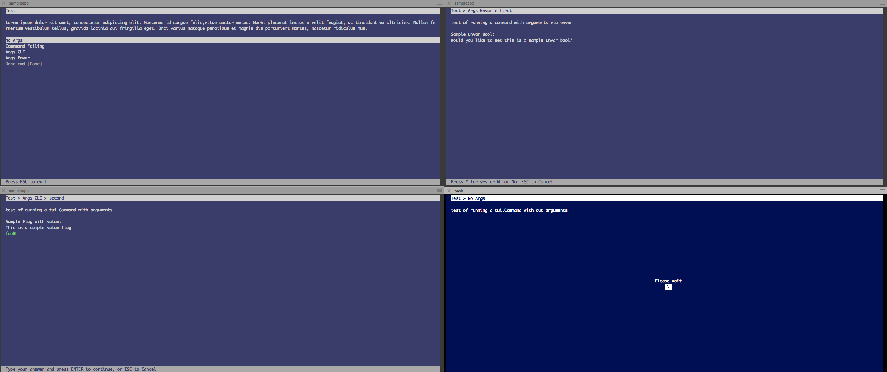

# TUI
[](https://godoc.org/github.com/vtuson/tui)
[](https://github.com/vtuson/tui/blob/master/LICENSE)

This is a Basic Implementation of a text ui D.O.S style, that can be used to run CLI commands or you can define your own HandlerCommand to run Go functions

Basic Structure is:

- Menu

- Commands - Each menu can have a set of commands to present

- Args - Each command can have a set of arguments that get passed
 
The idea behing TUI is provide a simple library similar to the cli libs like https://github.com/urfave/cli that allows you to build a menu based application for terminal users. 
 
By default a CLI command handler is provided that is able to pass parameters as flag, options or Enviroment variables
You can find an example app in the /sampleapp folder
 
 
 
 ## Sample app
 The project comes with a sample app under the folder /sampleapp
 
 ```
  cd sampleapp
  godep get
  go run app.go
 ```
  
## Getting started with tui

### A basic shell
Lets write a small application, You need to import the package, and create a basic menu with no option:

 ``` go
package main

import (
	"github.com/vtuson/tui"
)

func main() {
	menu := tui.NewMenu(tui.DefaultStyle())
	menu.Title = "Test"
	menu.Description = "Test app"
	menu.Show()
 
 // This function handles input events like key strokes
	go menu.EventManager()
 
 //Menu contains a channel that lets you know when the user has exited it
	<-menu.Wait
 
 //Quits the menu, and cleans the screen
	menu.Quit()
}
```
### Adding a command without arguments
Now lets add a small OS [command](https://godoc.org/github.com/vtuson/tui#Command) that will run without need for arguments. 

``` go
package main

import (
	"github.com/vtuson/tui"
)

func main() {
	menu := tui.NewMenu(tui.DefaultStyle())
	menu.Title = "Test"
	menu.Description = "Test app"

	menu.Commands = []tui.Command{
		tui.Command{
			Title:       "No Args",
			Cli:         "echo hello!",
			Description: "just being polite",
			Success:     "Yey it works",
			PrintOut:    true,
		},
	}

	menu.Show()
	go menu.EventManager()
	<-menu.Wait
	menu.Quit()
}
```

The option Printout allows for the output of the command to be shown to the user. The Description and Success are strings that will be use to add more context to the command execution. They are optional and dont need to be set if you don't want to.

### Commands with arguments
You can also add argument to command that a user can input

``` go
package main

import (
	"github.com/vtuson/tui"
)

func main() {
	menu := tui.NewMenu(tui.DefaultStyle())
	menu.Title = "Test"
	menu.Description = "Test app"

	menu.Commands = []tui.Command{
		tui.Command{
			Title:       "Args CLI",
			Cli:         "echo",
			PrintOut:    true,
			Description: "test of running a tui.Command with arguments",
			Args: []tui.Argument{
				tui.Argument{
					Title: "Please say hi",
				},
			},
		},
	}

	menu.Show()
	go menu.EventManager()
	<-menu.Wait
	menu.Quit()
}
```
[Arguments](https://godoc.org/github.com/vtuson/tui#Argument) can also be boolean flags, they can have a name (which can be passed as input to the command) or can be set as environment variables.

### Adding your own handler
The library assumes that the command is an OS command to be executed using the provided OSCmdHandler function if the Execute is nil. If another handler is passed by setting the Excute value, then it will be called when the users selects that command.

Here is a simple echo example:

``` go
package main

import (
	"github.com/vtuson/tui"
	"errors"
)

//This is the customer handler c is the command object for the command to be excuted. 
//ch is the channel that can be used to return text to be displayed back to the user.
//The hadnler is excuted async from the main program, so you must close the channel when completed or the menu will hang 
//waiting for your command to complete.

func CustomHandler(c *tui.Command, ch chan string) {
	//defer close to make sure when you exit the menu knows to continue giving user the output
	defer close(ch)
	for _, a := range c.Args {
		ch <- a.Value
	}
	//if you want the command to fail set Error in the command variable
	c.Error=errors.New("It failed!")
}

func main() {
	menu := tui.NewMenu(tui.DefaultStyle())
	menu.Title = "Test"
	menu.Description = "Test app"

	menu.Commands = []tui.Command{
		tui.Command{
			Execute:     CustomHandler,
			Title:       "Args CLI",
			Cli:         "echo",
			PrintOut:    true,
			Description: "test of running a tui.Command with arguments",
			Args: []tui.Argument{
				tui.Argument{
					Title: "Please say hi",
				},
			},
		},
	}

	menu.Show()
	go menu.EventManager()
	<-menu.Wait
	menu.Quit()
}
```
